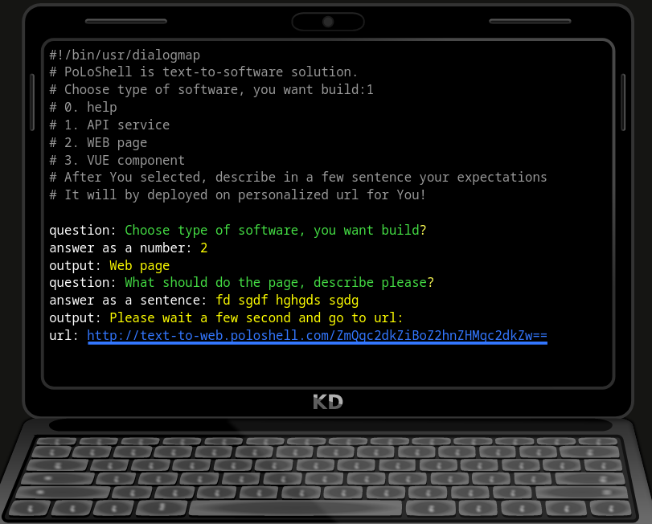
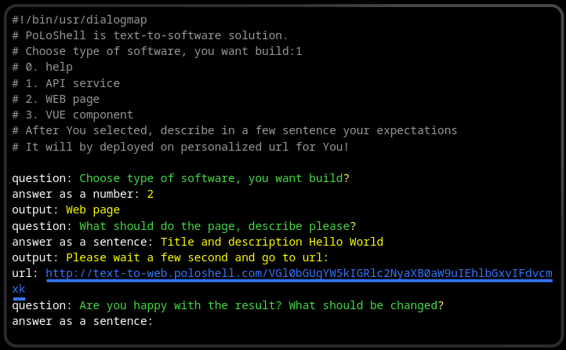

# www.poloshell.com

+ shellUI
+ SpeechCli

+ [Poloshell](https://app.poloshell.com/)

+ [GitHub Corners](https://tholman.com/github-corners/)

## SHELL

+ [How to Change Shell in Linux](https://linuxhandbook.com/change-shell-linux/)
+ 

### [Install Zsh and Make it default Shell in Linux](https://linuxhandbook.com/install-zsh/)

+ [News about ZSH](https://zsh.sourceforge.io/News/)
+ [Install Zsh and Make it default Shell in Linux](https://linuxhandbook.com/install-zsh/)
+ [StartupFiles/zshrc · master · zsh-org / zsh · GitLab](https://gitlab.com/zsh-org/zsh/-/blob/master/StartupFiles/zshrc)

### MOSH

[Mosh: the mobile shell](https://mosh.org/#getting)

> # Mosh
> 
> ## (mobile shell)
> 
> Remote terminal application that allows **roaming**, supports **intermittent connectivity**, and provides intelligent **local echo** and line editing of user keystrokes.
> 
> Mosh is a replacement for interactive SSH terminals. It's more robust and responsive, especially over Wi-Fi, cellular, and long-distance links.
> 
> Mosh is free software, available for GNU/Linux, BSD, macOS, Solaris, Android, Chrome, and iOS.

### How to install Zsh
> 
> This tutorial is tested on Ubuntu 18.04 LTS. It should work with other versions of Ubuntu as well. If not, tell us in the comments.
> 
> You can install **zsh** with following commands in Debian/Ubuntu based distributions:
> 
>     sudo apt-get update
>     sudo apt-get install zsh
> 
> You need sudoer rights to run above commands. If you don’t have such rights, contact your system admin. If you are the administrator, then [refer to this article to learn about creating a sudoer](https://linuxhandbook.com/create-sudo-user/).
> 
> In [Fedora](https://getfedora.org/), Red Hat and CentOS, you can use the [DNF package manager](https://fedoraproject.org/wiki/DNF?rd=Dnf) to install Zsh:
> 
>     sudo dnf install zsh

### [fish shell](https://fishshell.com/)

+ [fish-shell/fish-shell: The user-friendly command line shell.](https://github.com/fish-shell/fish-shell)
+ 
+ [Introduction — fish-shell 3.5.1 documentation](https://fishshell.com/docs/current/index.html)

## poloshell command controll OS

[Zabaware - Hal Windows 'Most Human' Computer in Loebner Competition](https://www.zabaware.com/loebner.html#page=/ultrahal/;)

> ## Ultra Hal can hold conversations with you
> 
> Have you ever thought that you could chat with your computer just like you would with a human being? Well, you can. Ultra Hal can chat about anything you want. Ultra Hal has a huge conversational database so Hal will never get boring. Ultra Hal also has the ability to learn. Ultra Hal will learn from every sentence that you say, and after a while of chatting Hal will develop a similar personality to yours. If you wish, you may try chatting with our web version of Ultra Hal. Remember that the web version will not speak out loud to you and you will have to type to it. However, the Windows version of Hal does speak out loud to you and you are able to speak to it. Here is a screen shot of what Hal would look like on your computer.
> 
> ## Both a Companion and Assistant
> 
> Ultra Hal is a great conversationalist and you can have hours of entertainment just chatting with him. But in addition to being a great companion Hal can be an assistant and help increase your productivity. Ultra Hal can remember anything you tell him. Use Hal's memory to remember phone numbers, email addresses, street addresses, appointments, birthdays, or anything else that you can think of. Hal can automatically dial phone numbers for you. Hal can automatically start emails for you. Hal can automatically remind you of important dates.
> 
> Ultra Hal can run programs for you and offer help with programs. Hal automatically finds all of the Windows programs you have in your start menu. You can tell him to run any program you have and he will run it. It is much easier then searching through all the folders in the start menu to find the program you want.
> 
> Ultra Hal can help you browse the Internet by telling you what your local weather is, telling you the current news, and even performing an Internet search for you. You can also ask Hal the definition of any word.
> 
> The following conversation is an example conversation between Ultra Hal and a person. It demonstrates many of Hal's features.
> 
> Chat User: Hello Hal
> 
>   Hal: Good afternoon, User. Is it time for afternoon coffee?
> 
> Chat User: I drink coffee in the morning
> 
>   Hal: In the morning, I am not worth a darn until my first cup of coffee.
